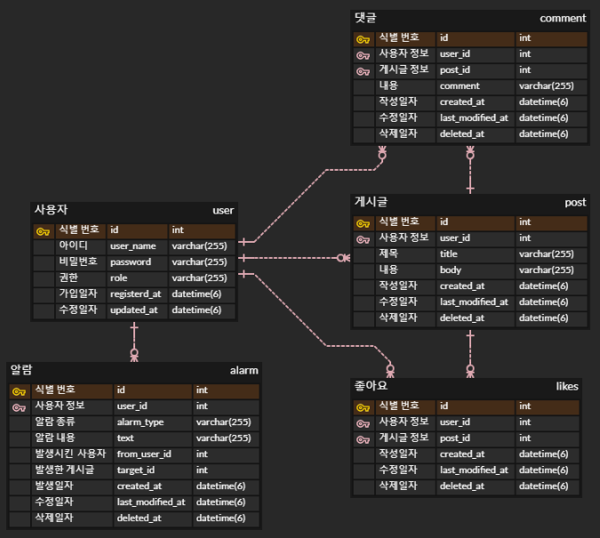

# MutsaSNS
> 회원 가입, 로그인, 인증·인가를 기반으로 게시글과 댓글의 CRUD, 마이 피드, 좋아요, 알람 기능을 구현한 SNS 웹 페이지
---
## URL
> - [Swagger](http://ec2-52-78-223-101.ap-northeast-2.compute.amazonaws.com:8080/swagger-ui/)
> - [WebPage](http://ec2-52-78-223-101.ap-northeast-2.compute.amazonaws.com:8080/swagger-ui/)
---
## ERD

---
## 체크리스트
📃Swagger : API 문서 자동화. 간편하게 API 테스트 가능
- 어노테이션을 활용하여 각 기능별 이름, 설명, 매게변수를 정리

📃GitLab CI/CD Pipeline : 배포 자동화
- Dockerfile, gitlab-ci.yml 로 CI 구축. main branch 에  push 될 때만 image update.
- image update 된 경우에만 배포하도록 deploy.sh 작성
- crontab 으로 매 분마다 deploy.sh 자동 실행.

📃User 회원 가입과 로그인
- 회원 가입 : userName, password 입력을 통한 가입
  - userName 중복 체크
  - password 복호화
- 로그인 : 로그인 성공 시 JWT 토큰 발급

📃Post 작성·조회·수정·삭제
- 작성 : 로그인한 사용자만 작성 가능. Security filter chain 에서 JWT 토큰 검증 (존재·만료 여부)
- 조회 : 로그인 하지 않아도 조회 가능. Post 목록 조회 기능 포함.
  - Post 목록 조회는 20개 단위로 페이징 됨
- 수정 : 해당 Post 를 작성한 사용자만 수정 가능. JWT 토큰을 열어 userName 검증.
- 삭제 : 해당 Post 를 작성한 사용자만 삭제 가능. JWT 토큰을 열어 userName 검증. DB 에서의 논리적 삭제로 구현


  
## Endpoint

### User

#### 회원가입
`POST /api/v1/users/join`

**Request Body**
```json
{
"userName": "String",
"password": "String",
}
```

**Response Body**
```json
{
    "resultCode": "SUCCESS",
    "result": {
        "userId": Integer,
        "userName": "String"
    }
}
```
<br>

#### 로그인
`POST /api/v1/users/login`

**RequestBody**
```json
{
"userName": "String",
"password": "String"
}
```

**Response Body**
```json
{
  "jwt": "String"
}
```
<br>

#### ADMIN 승급
`POST api/v1/user/{id}/role/change`

**Response Body**
```json
{
  "resultCode": "SUCCESS",
  "result": {
    "userName": "string",
    "message": "ADMIN 승급 성공"
  }  
}
```
<br>


### Post
#### 리스트 조회
`GET /api/v1/posts`

**Response Body**
```json
{
  "resultCode": "SUCCESS",
  "result": {
    "content" : [ {
      "title": "String",
      "body": "String",
      "userName": "String",
      "createdAt": "yyyy-mm-dd hh:mm:ss",
      "lastModifiedAt":  "yyyy-mm-dd hh:mm:ss",
      "id": Integer
    } ] ,
    "pageable": {
      "sort": {
        "empty": false,
        "sorted": true,
        "unsorted": false
      },
      "offset": 0,
      "pageNumber": 0,
      "pageSize": 20,
      "paged": true,
      "unpaged": false
  }
}
```

#### 상세 조회
`GET /api/v1/posts/{id}`

**Response Body**
```json
{
  "id": Integer,
  "title": "String",
  "body": "String",
  "userName": "String",
  "createdAt": "yyyy-mm-dd hh:mm:ss",
  "lastModifiedAt": "yyyy-mm-dd hh:mm:ss"
}
```
<br>

#### 작성 
`POST /api/v1/posts`

**Request Body**
```json
{
    "title": "String",
    "body": "String"
}
```

**Response Body**
```json
{
    "resultCode": "SUCCESS",
    "result": {
        "message": "포스트 등록 완료",
        "postId": Integer
    }
}
```

#### 수정 
`PUT /api/v1/posts/{id}`

**Request Body**
```json
{
    "title": "String",
    "body": "String"
}
```

**Response Body**
```json
{
    "resultCode": "SUCCESS",
    "result": {
        "message": "포스트 수정 완료",
        "postId": Integer
    }
}
```

#### 삭제 
`DELETE /api/v1/posts/{id}`

**Response Body**
```json
{
    "resultCode": "SUCCESS",
    "result": {
        "message": "포스트 삭제 완료",
        "postId": Integer
    }
}
```
<br>